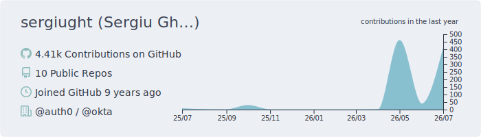
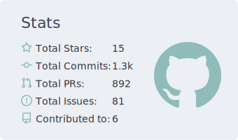
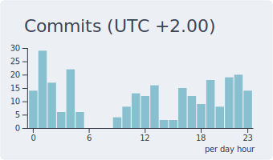
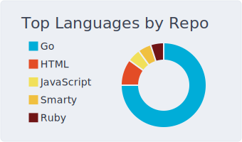
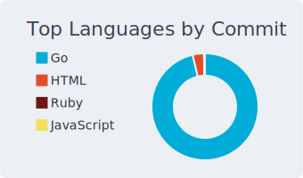

[][1]

[][1]
[][1]
[][1]
[][1]
[][1]

---

## Hi there 👋,

Senior software engineer based in Spain 🇪🇸.

Day to day: Go, Terraform, fine-grained authorization, and the backend infrastructure underneath. Usually on problems where they pull on each other. I lean broad rather than deep, which is useful when the problem doesn’t fit a single specialty. Most of what I build is in service of developer experience: the small frictions that compound into real costs when you ignore them. Always up for a hard problem, always looking to make the next one less painful.

Off the clock, I’m a serious foodie. I love hunting down new restaurants, cooking things I’ve never tried, and traveling to cities with a reputation worth eating my way through.

## 📬 Get in touch

## 🚀 My latest projects

- **[auth0-mock](https://github.com/sergiught/auth0-mock)** — Drop-in mock Auth0 HTTP API for tests and local dev: real RS256 JWTs, 400+ Management API endpoints, no code changes required.
- **[go-openfga](https://github.com/sergiught/go-openfga)** — A hand-crafted, idiomatic Go client for the OpenFGA HTTP API.
- **[openfga-cli](https://github.com/sergiught/openfga-cli)** — A modern CLI & TUI for OpenFGA.

## ✍️ My recent blog posts

<!-- BLOG-POST-LIST:START -->
- [Stop pointing your tests at a real Auth0 tenant](https://sergiu.dev/posts/auth0-mock/) — May 27, 2026
- [Most engineering initiatives don&#39;t fail at execution](https://sergiu.dev/posts/shipping-engineering-initiatives/) — May 10, 2026
- [OpenFGA: the authorization layer your code keeps trying to reinvent](https://sergiu.dev/posts/openfga-primer/) — May 9, 2026
- [An encrypted Arch Linux install you can actually maintain](https://sergiu.dev/posts/archlinux/) — May 8, 2026<!-- BLOG-POST-LIST:END -->

## :zap: Recent Activity

<!--START_SECTION:activity-->
1. 🎉 Merged PR [#32](https://github.com/sergiught/openfga-cli/pull/32) in [sergiught/openfga-cli](https://github.com/sergiught/openfga-cli)
2. 💪 Opened PR [#32](https://github.com/sergiught/openfga-cli/pull/32) in [sergiught/openfga-cli](https://github.com/sergiught/openfga-cli)
3. 🎉 Merged PR [#31](https://github.com/sergiught/openfga-cli/pull/31) in [sergiught/openfga-cli](https://github.com/sergiught/openfga-cli)
4. 💪 Opened PR [#31](https://github.com/sergiught/openfga-cli/pull/31) in [sergiught/openfga-cli](https://github.com/sergiught/openfga-cli)
5. ℹ️ Labeled PR [#30](https://github.com/sergiught/openfga-cli/pull/30) in [sergiught/openfga-cli](https://github.com/sergiught/openfga-cli)
<!--END_SECTION:activity-->

## 🧰 Languages and Tools

  &nbsp;
  &nbsp;
  &nbsp;
  &nbsp;
  &nbsp;
  &nbsp;
  &nbsp;
  &nbsp;
  &nbsp;

## :bar_chart: GitHub Stats

<!-- Links --->
[1]: https://github.com/sergiught